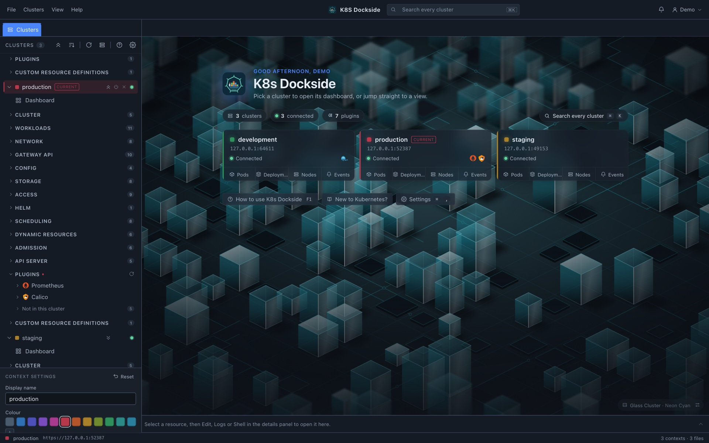
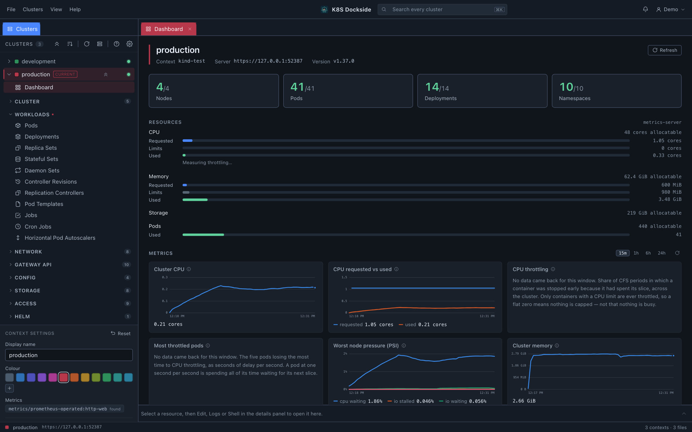
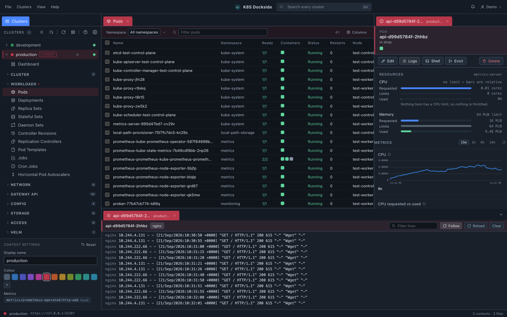
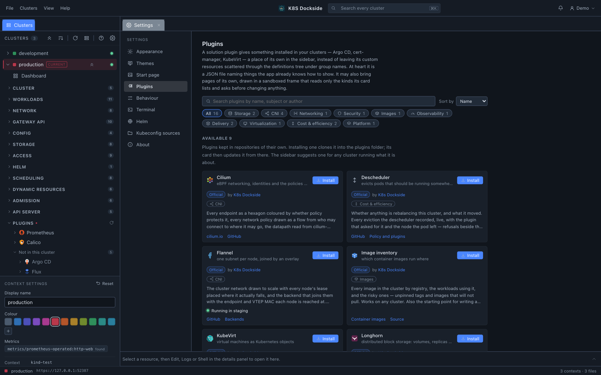

<div align="center">

# K8s Dockside

**Every Kubernetes cluster you have, in one window: on your desktop, or in your browser.**

[](https://github.com/k8sdockside/k8sdockside/actions/workflows/ci.yml)
[](https://github.com/k8sdockside/k8sdockside/releases/latest)
[](LICENSE)


</div>

## What is it

K8s Dockside is a workspace for the Kubernetes clusters you already have access
to. It comes in two editions, built from the same code:

| 🖥️ **Desktop app** | 🌐 **Web app, in your cluster** |
|---|---|
| For macOS, Windows and Linux. It reads the kubeconfigs on your machine, and your credentials never leave it. | Installed with Helm, or as plain manifests. Your team opens it in a browser and signs in with a local account, GitHub, Google, Microsoft, GitLab, Facebook or any OIDC provider. |

Either way, you get every cluster in one sidebar and each view as a tab. Every
context has a name and a colour you choose, and its tabs wear that colour, so
you can always see whether you're about to delete a pod in staging or in
production. Tables update live, custom resources are first-class, and plugins
add proper views for the tools you run. It's free and open source, under
Apache 2.0.

## Screenshots

**The start page: every cluster at a glance**



**The cluster dashboard**



**Pods, with each pod's metrics and live log**



**Plugins: switch them on, or install your own**



[More screenshots →](./docs/images/)

## Why you might want it

- 🧭 **Many clusters, one window.** No more one terminal per context and a
  mental note of which is which.
- 🎨 **Colour as a safety rail.** Production is red because you made it red,
  and every tab, panel and editor that belongs to it stays red.
- ⚡ **Live, not refreshed.** Tables are backed by watches, so a rollout
  repaints as it happens. There's no refresh button, because there's nothing
  to refresh.
- 🧩 **Your CRDs and operators are first-class.** Custom resources open with
  the columns `kubectl get` prints. Plugins turn Argo CD, Flux, cert-manager,
  Cilium and friends into real views.
- 🔒 **Nothing leaves your machine that you didn't ask for.** Your kubeconfig
  is read, never written. There's no telemetry, and nothing to sign up for.
- 👥 **One tool for you and your team.** Run the desktop app yourself, and the
  same app in the cluster for everyone else.

## Install

### 🖥️ Desktop app

Download the build for your platform from the
[latest release](https://github.com/k8sdockside/k8sdockside/releases/latest):

| Platform | Download | Good to know |
|---|---|---|
| **macOS** | `.dmg`: `darwin-arm64` for Apple Silicon, `darwin-amd64` for Intel | Not notarised yet. On first launch, right-click the app and choose **Open**. |
| **Windows** | `-installer.exe`, or the `.zip` for a portable `.exe` | Unsigned. SmartScreen warns once: **More info → Run anyway**. |
| **Linux** | `.deb`, `.rpm`, `.pkg.tar.zst` or `.AppImage` | Needs GTK 4 and WebKitGTK 6. The packages pull them in; the AppImage expects them installed. |

<details>
<summary>Command-line install</summary>

```sh
# macOS: clear the quarantine flag instead of right-clicking
xattr -dr com.apple.quarantine "/Applications/k8sdockside.app"

# Debian / Ubuntu
sudo apt install ./k8sdockside-<version>-linux-amd64.deb

# Fedora / RHEL
sudo dnf install ./k8sdockside-<version>-linux-amd64.rpm

# Arch
sudo pacman -U ./k8sdockside-<version>-linux-amd64.pkg.tar.zst

# Anywhere else
chmod +x k8sdockside-<version>-linux-amd64.AppImage
./k8sdockside-<version>-linux-amd64.AppImage
```

</details>

Every release is signed, and comes with checksums and build provenance you can
check with `sha256sum -c --ignore-missing checksums.txt` and
`gh attestation verify <file> --repo k8sdockside/k8sdockside`.
[SECURITY.md](SECURITY.md#verifying-a-download) has the full recipe. To build it
yourself, see [docs/development.md](docs/development.md).

### 🌐 Web app, in your cluster

```sh
helm install k8sdockside oci://ghcr.io/k8sdockside/helm/k8sdockside \
  --namespace k8sdockside --create-namespace
kubectl -n k8sdockside port-forward svc/k8sdockside 8080:80
```

Open <http://127.0.0.1:8080> and create the first account, which becomes the
admin. The cluster it runs in is already there, read-only.

<details>
<summary>No Helm in your cluster? Use plain manifests</summary>

Render the chart once, then apply the result like any other manifests:

```sh
helm template k8sdockside oci://ghcr.io/k8sdockside/helm/k8sdockside \
  --namespace k8sdockside > k8sdockside.yaml
kubectl create namespace k8sdockside
kubectl apply -n k8sdockside -f k8sdockside.yaml
```

</details>

> **Keep in mind:** everyone who signs in acts with the pod's credentials, not
> their own. The chart defaults to read-only. Sign-in, OAuth, exposing it and
> the security model are all in [docs/server-mode.md](docs/server-mode.md).

## Get started

1. **Launch it.** It finds `~/.kube/config`, everything in `$KUBECONFIG`, and
   any other kubeconfig under `~/.kube`. Point it at more files, or at a whole
   folder, from the sidebar.
2. **Name and colour your contexts.** Select one and use the panel at the foot
   of the sidebar. This is the step worth doing properly: it's what makes the
   rest of the window readable.
3. **Open a cluster.** Click its card on the start page to see its dashboard,
   or pick a view under it in the sidebar. Each one opens as a tab in the
   context's colour.
4. **Click a row.** The details panel opens. From there you can **Edit** the
   live YAML, open a **Shell** in the container, **Forward** a port, or follow
   the **Logs**.

In the web app, you sign in and the clusters are already in the sidebar. The
guide to everything else is in the app: press **F1**.

## Security and network traffic

- **No telemetry.** No analytics, no crash reports, and nothing to sign up
  for. The project runs no servers, so there is nowhere for the app to report
  to.
- **It talks to your clusters,** using the credentials in your kubeconfigs, and
  those credentials go only to the API server they belong to.
- **One other automatic request:** an update check with GitHub that carries
  nothing but the app's version. You can switch it off in *Settings →
  Notifications*. The web version never checks on its own.
- **Everything else happens only when you ask for it:** installing a plugin,
  upgrading a Helm release, opening a link.
- **Your data goes to no one.** Beyond your clusters, the one fixed
  destination is GitHub (a US company owned by Microsoft), and it receives only
  the update check. The app contacts no server in China, or anywhere else.
- **Plugins are fenced in.** Their pages run sandboxed with no network access,
  and read only the resource kinds they declare, never Secrets.

📄 **[Every connection the app makes, and how to switch it off](docs/network-and-privacy.md)**:
one page, with pointers to the code. To report a vulnerability, see
[SECURITY.md](SECURITY.md).

## Features

### 🗂️ All your clusters, sorted
Kubeconfigs are found for you, and whole folders can be watched. Every context
gets its own name and colour, and a start page shows each cluster as a card:
whether it's connected, and which products it runs. A kubeconfig that won't
parse is listed with the reason, not quietly dropped.

### ⚡ Live, fast tables
Watches instead of polling, with one watch per kind shared by every tab. Filter
by any number of namespaces at once. Every kind Kubernetes 1.37 serves is here,
along with the Gateway API and your own CRDs, with the same columns
`kubectl get` shows.

### 🔎 Search every cluster
Press `⌘K` to find any object by name, across every kind in every cluster.
Results arrive cluster by cluster, and a Secret's values are never read.

### 🛠️ Change things safely
- A details panel with an object's conditions, owners and related objects, one
  click apart
- Live YAML editing with conflict-safe saves: a save against an object that has
  changed since is refused, not forced
- Scale, restart, roll back, pause a rollout, run a CronJob now, cordon, drain,
  evict, approve a CSR, and more
- Bulk delete and bulk patch, showing exactly what each object will receive
  before anything is sent

### 💻 Shells, logs and port forwards
A shell in any container, or on a node, in the app's dock or in your own
terminal. Live logs per container. Port forwards that work out the pod's port
from the service for you, and are remembered between sessions.

### 📈 Metrics without setup
A dashboard of capacity, requests and workload health. Prometheus is found
automatically and reached through the API server: no port forward, no second
credential.

### ⎈ Helm releases
Browse the Helm releases in every namespace, see their history and values, and
upgrade, roll back or uninstall them.

### 🧩 Plugins for the tools you run
- **Built in:** Argo CD, Flux and Prometheus
- **A click away** in *Settings → Plugins*: cert-manager, Longhorn, Rook Ceph,
  MetalLB, Cilium, Calico, Kube-OVN, Flannel, KubeVirt, Descheduler, an
  optimization advisor, an image inventory and Vitistack
- **Only where they belong.** A plugin draws its panels and buttons only in
  clusters that run its product, and the sidebar suggests one when a cluster
  does
- **Write your own.** A plugin is a JSON file, and can bring pages of its own in
  plain JavaScript or TypeScript. Start with
  [Writing a plugin](docs/writing-plugins.md)

### 🎨 Make it yours
14 themes, from K8s Dockside Dark to Nord and Catppuccin Mocha, and your own as
simple JSON files. A start page with 25 generated backgrounds that change on a
timer, dark or light to match your theme, or pictures from your own folder.
Zoom, row density, and a layout that is remembered between launches.

### 🔔 Always current
A bell in the title bar says when a new release is out, and offers the download
that matches how you installed it.

## Where your things live

Settings are stored in `$XDG_CONFIG_HOME/k8sdockside/settings.json` (or
`~/.config/k8sdockside/`) on macOS and Linux, and in `%AppData%` on Windows. The
exact path is shown in the status bar. Your themes and plugins go in `themes/`
and `plugins/` folders beside it.

## Documentation

Inside the app, **Help** (F1) is the guide to the app itself, and the
**Kubernetes primer** in the Help menu explains the cluster and its terms for
anyone new to them.

- [Network traffic and privacy](docs/network-and-privacy.md): every connection
  the app makes, and how to switch it off
- [Server mode](docs/server-mode.md): the web app, with sign-in, OAuth and the
  Helm chart
- [Writing a plugin](docs/writing-plugins.md): from an empty folder to a
  published plugin
- [Plugin reference](docs/plugins.md): every manifest field, and the bridge a
  plugin's pages use
- [Themes](docs/themes.md): the theme format
- [Architecture](docs/architecture.md): how the cluster data gets here, and the
  code layout
- [Development](docs/development.md): building, testing and cutting a release

## Contributing

Issues and pull requests are welcome. CI runs build, test, lint and security
scans on every push, and `make precheck` runs the same checks locally, which is
worth doing before you push.

To report a security issue, please see [SECURITY.md](SECURITY.md) rather than
opening a public issue.

## License

[Apache License 2.0](LICENSE). Built with [Wails v3](https://v3.wails.io/) and
[Svelte 5](https://svelte.dev/).
